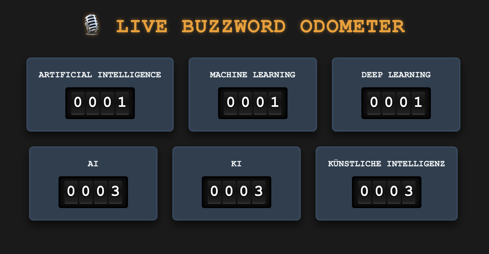

# 🎙️ Retro Buzzword Counter

A real-time, AI-powered microphone listener that tracks specific "buzzwords" (like AI, Machine Learning, etc.) during a presentation and increments retro, analog-style rolling odometers on a web dashboard.

<div align="center">
  
</div>

Powered locally by **faster-whisper** for ultra-fast, offline, bilingual (English & German) speech recognition!

## ✨ Features

- **Real-Time AI Transcription:** Uses your default microphone to transcribe speech instantly.
- **Dynamic Microphone Selection:** Seamlessly switch between microphones (or virtual loopbacks like BlackHole) directly from the web dashboard without restarting the server!
- **Bilingual Auto-Detection:** Seamlessly understands both English and German phrasing without manually switching languages.
- **Ultra-Fast Local Inference:** Bypasses standard APIs to use `faster-whisper` directly on your CPU/GPU, ensuring your data never leaves your machine.
- **JSON State Persistence:** Automatically saves your buzzwords and their current counts to a local `buzzwords.json` file. You can reboot the server without losing your curated list or progress!
- **Retro Odometer UI:** Gorgeous 4-digit mechanical rolling wheels that spin up when a buzzword is detected.
- **Mechanical Sound Effects:** Generates synthetic "click" sounds via the Web Audio API every time an odometer turns.
- **Dynamic Configuration:** Add, remove, or reset tracked buzzwords on the fly through the web UI.
- **Dynamic Responsive Grid:** The presentation layout uses a custom algorithm that perfectly stacks your odometers into a symmetrical, centered grid regardless of if you have 1 buzzword or 20!
- **Presentation & Totals Mode:** Clean, scaled-up, full-screen dashboards designed for projectors. Features a "Totals Mode" that continuously aggregates all buzzwords into one master odometer. You can customize the title via the Settings menu.
- **Individual Embeds:** Get transparent, borderless iframe links for individual odometers to embed directly into PowerPoint Web Viewer or OBS Studio.
- **Smart Phonetic Aliasing:** Secretly corrects Whisper's common misspellings for short acronyms (e.g., mapping "k.e." to "KI").
- **Strict Regex Word Boundaries:** Prevents false-positives when short acronyms are buried inside larger words (e.g., "AI" won't trigger if you say "again").
- **Dual-Engine Architecture:** Choose between the ultra-lightweight original engine, or the blazing fast `RealtimeSTT` VAD streaming engine using command-line arguments.
- **"Denglish" Support:** Optimized to flawlessly transcribe German sentences peppered with English IT terms without aggressively translating them.

## 🚀 Installation

This tool runs purely on Python and works on both **macOS** and **Windows**.

### 1. Install System Audio Drivers (macOS only)
If you are on a Mac, you need to install PortAudio so Python can access your microphone. (Windows users can skip this step).
```bash
brew install portaudio
```

### 2. Setup Python Environment
Open your terminal (or Command Prompt/PowerShell on Windows), navigate to this folder, and create a virtual environment:

**macOS:**
```bash
python3 -m venv .venv
source .venv/bin/activate
```
**Windows:**
```cmd
python -m venv .venv
.venv\Scripts\activate
```

### 3. Install Dependencies
Install the required Python libraries using the provided requirements file:
```bash
pip install -r requirements.txt
```

## 🎮 Usage

1. **Start the Server:**
Ensure your virtual environment is activated, then run the app. You can choose which AI engine to boot using the `--engine` flag:

```bash
# Launch with the ultra-lightweight, 32-bit Classic engine (default)
python app.py --engine classic

# Launch with the lightning-fast, 8-bit quantized RealtimeSTT engine
python app.py --engine realtimestt
```
*(Tip: You can also create a `config.json` file in the root folder with `{"engine": "realtimestt"}` to set a permanent default!)*
*(Note: The very first time you run this, it will take a minute or two to download the Whisper AI model to your computer).*

2. **Calibrate:**
When the script starts, it will say `🎙️ Calibrating microphone...`. Stay completely quiet for 3 seconds so the AI can measure your room's background static.

3. **Open the Dashboard:**
Open your web browser and go to:
**[http://127.0.0.1:5000](http://127.0.0.1:5000)**

4. **Present!**
Start speaking! Every time you say one of the configured buzzwords, the odometers will instantly roll up. 
- Click **"📺 Presentation Mode"** for the projector-friendly view.
- Click **"🔗 Get Embed Link"** to grab a URL for PowerPoint or OBS.
